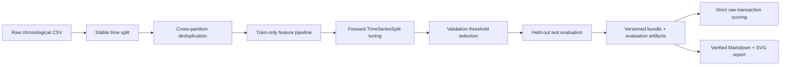

# Credit Card Fraud Detection Pipeline

[](https://github.com/fauzanazz/ml-engineering/actions/workflows/fraud-detection-pipeline-ci.yml)

An end-to-end ML engineering repository for detecting fraudulent card transactions under severe class imbalance. False negatives represent missed fraud; false positives create investigation cost and customer friction. The pipeline therefore selects an operating threshold on validation data and reports both error types on a held-out temporal test set.

## Architecture



Core controls:

- Stable chronological sorting preserves CSV order for equal timestamps.
- Splitting occurs before deduplication; later partitions remove feature-identical rows seen earlier.
- `FeaturePipeline` is fitted only on each training partition, including independently inside every temporal CV fold.
- Tuning uses average precision with forward-only `TimeSeriesSplit`; class weighting is recomputed from each fold's training labels.
- The fitted preprocessing pipeline, estimator, raw input schema, and selected threshold are persisted together.
- Run metadata records the dataset SHA-256, split time ranges and class support, runtime versions, tuning protocol, confusion counts, and artifact hashes.

## Locked setup

Requires Python 3.11 or newer and [uv](https://docs.astral.sh/uv/).

```bash
uv sync --locked
uv run pytest -q
```

CI runs the same locked install and test command on Python 3.13. It does not require the raw dataset or Kaggle credentials.

## Dataset

Use the Kaggle **Credit Card Fraud Detection** dataset described in [`data/README.md`](data/README.md), then place it at:

```text
data/creditcard.csv
```

The canonical benchmark used all 284,807 rows and verified the file fingerprint recorded in the [full-dataset report](docs/full-dataset-benchmark.md). Raw CSV files are ignored by Git.

## Train, report, and score

Run the predeclared full-data protocol:

```bash
uv run fraud-detect-train \
  --data-path data/creditcard.csv \
  --batch-size 284807 \
  --model random-forest \
  --imbalance-strategy scale-pos-weight \
  --val-size 0.1 \
  --test-size 0.2 \
  --threshold-objective target-recall \
  --target-recall 0.95 \
  --tune \
  --tune-n-candidates 50 \
  --tune-cv 3 \
  --seed 42 \
  --artifact-dir artifacts/runs
```

Generate reviewable evidence from the printed run directory:

```bash
uv run fraud-detect-report \
  --run-dir artifacts/runs/<run-id> \
  --output-dir docs
```

Score one raw transaction:

```bash
uv run fraud-detect-score \
  --run-dir artifacts/runs/<run-id> \
  --input-path examples/transaction.json \
  --trust-artifact
```

`examples/transaction.json` is synthetic schema-only data. It contains exactly `Time`, `Amount`, and `V1`–`V28`; `Class` is intentionally absent because scoring rejects target and extra columns.

## Canonical full-dataset result

The single predeclared tuned Random Forest run used 50 Optuna TPE trials, average precision, three effective forward temporal folds, seed 42, and a held-out final 20% test partition. Full provenance, split audits, runtime versions, plots, and limitations are in [`docs/full-dataset-benchmark.md`](docs/full-dataset-benchmark.md).

| Held-out test metric | Observed value |
|---|---:|
| Precision | 0.918033 |
| Recall | 0.756757 |
| F1 | 0.829630 |
| PR AUC | 0.821074 |
| ROC AUC | 0.962580 |
| True positives | 56 |
| False positives | 5 |
| False negatives | 18 |
| True negatives | 56,642 |

The requested validation recall of 0.95 was not achievable. The deterministic F1 fallback selected threshold `0.249874677029`; the run records `target_met=false` and `fallback_used=true`. No model or threshold was changed after observing held-out test metrics.

Earlier 10k/50k experiments remain dated historical evidence in [`docs/run-log.md`](docs/run-log.md); they are not the current benchmark or a basis for selecting this held-out result.

## Artifact contract and trust

Each local run directory contains:

- `config.json`: schema version 1 provenance, training, split, tuning, threshold, and SHA-256 manifests.
- `metrics.json`: schema version 1 validation/test metrics and latency protocol.
- `bundle.joblib`: estimator, fitted `FeaturePipeline`, raw input column order, model key, and effective threshold.
- `evaluation.npz`: held-out labels and scores used to generate the report without loading the pickle bundle.

`joblib` is pickle-based and can execute arbitrary code. SHA-256 detects substitution but does not make an untrusted pickle safe. `fraud-detect-score` requires explicit `--trust-artifact`, and `load_bundle(..., trusted=True)` must only be used for artifacts from a trusted source. Run binaries and row-level data remain ignored and are not published.

See [`docs/artifact-security.md`](docs/artifact-security.md) for the security boundary.

## Reproducibility

- Dependencies are locked in `uv.lock`.
- All model factories, Optuna sampling, and final training receive the recorded seed.
- Equal-time records use stable sorting.
- The run records the exact effective CLI command, dataset fingerprint, runtime package versions, split audits, effective temporal fold count, and tuned parameters.
- Reports verify `evaluation.npz` against its manifest and refuse to overwrite existing evidence.
- The committed report and SVGs are generated from one run; local model and evaluation binaries are intentionally excluded from version control.

## Limitations

- The dataset is from 2013 and may not represent current fraud behavior.
- V1–V28 are anonymized PCA features, limiting feature-level interpretation.
- Evaluation uses one held-out temporal split rather than repeated production backtests.
- There is no drift or feedback monitoring.
- There is no deployed API, serving path, dashboard, or external experiment tracker.
- Latency is machine-specific and is not a production service-level guarantee.
