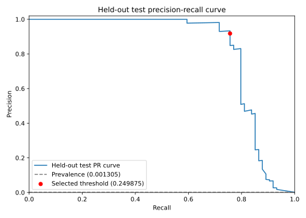
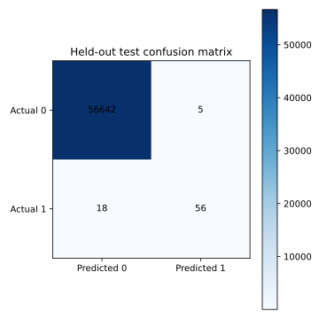

# Full-Dataset Fraud Detection Benchmark

## Reproduction

- Command: `fraud-detect-train --data-path data/creditcard.csv --batch-size 284807 --model random-forest --imbalance-strategy scale-pos-weight --val-size 0.1 --test-size 0.2 --threshold-objective target-recall --target-recall 0.95 --tune --tune-n-candidates 50 --tune-cv 3 --seed 42 --artifact-dir artifacts/runs`
- Dataset: `data/creditcard.csv`
- Dataset rows: 284807
- Dataset columns: 31
- Dataset bytes: 150828752
- Dataset SHA-256: `76274b691b16a6c49d3f159c883398e03ccd6d1ee12d9d8ee38f4b4b98551a89`
- Started (UTC): 2026-07-16T10:35:25.140477+00:00
- Training duration: 3187.774813 s
- Seed: 42

## Runtime

- Python: 3.13.13
- Platform: macOS-26.4.1-arm64-arm-64bit-Mach-O
- Packages: joblib 1.5.3, lightgbm 4.6.0, numpy 2.4.4, optuna 4.8.0, pandas 3.0.2, scikit-learn 1.8.0, xgboost 3.2.0

## Model and tuning protocol

- Model: `random-forest` (RandomForestClassifier)
- Batch size: 284807
- Imbalance strategy: `scale-pos-weight`
- Tuning: 50 Optuna TPE trials; average_precision; TimeSeriesSplit with 3 effective folds; best CV score 0.749101; params `{"max_depth": null, "min_samples_leaf": 1, "min_samples_split": 5, "n_estimators": 200}`
- Chronological split: validation=0.1, held-out test=0.2

| Partition | Rows | Positives | Negatives | Time min | Time max |
|---|---:|---:|---:|---:|---:|
| train | 198648 | 366 | 198282 | 0.000000 | 132928.000000 |
| val | 28357 | 33 | 28324 | 132929.000000 | 145247.000000 |
| test | 56721 | 74 | 56647 | 145248.000000 | 172792.000000 |

## Selected operating threshold

- Objective: `target-recall`
- Target recall: 0.950000
- Selected threshold: 0.249874677029
- Target met: false
- F1 fallback used: true

## Held-out test results

| Metric | Value |
|---|---:|
| Precision | 0.918033 |
| Recall | 0.756757 |
| F1 | 0.829630 |
| PR AUC | 0.821074 |
| ROC AUC | 0.962580 |
| True positives | 56 |
| True negatives | 56642 |
| False positives | 5 |
| False negatives | 18 |
| Positive support | 74 |
| Negative support | 56647 |

## Inference latency

- Batch `predict_proba`: 0.184914 s
- Per row: 0.000003 s
- Single row: 0.002886 s
- Protocol: 1 warmup call; 5 single-row repeats; median statistic
- Environment: macOS-26.4.1-arm64-arm-64bit-Mach-O; Python 3.13.13

## Limitations

- The dataset is from 2013 and may not represent current fraud patterns.
- V1-V28 are anonymized PCA features, limiting feature-level interpretation.
- Evaluation uses one held-out temporal split rather than repeated production backtests.
- No drift or feedback monitoring is implemented.
- No deployed serving path is included.
- Latency is machine-specific and is not a production service-level guarantee.
