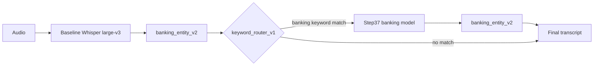

# Indonesian Banking ASR

A keyword-routed Whisper pipeline that improves Indonesian banking transcription while preserving a strong general-Indonesian path.

## Measured outcomes

Recorded on a 511-row test split: **156 synthetic banking** utterances plus **355 real non-banking Indonesian** utterances from BabelSpeech.

| Slice | Baseline + `banking_entity_v2` | Routed pipeline | Change |
|---|---:|---:|---:|
| All — WER | 12.35% | **11.35%** | 8.1% relative reduction |
| Synthetic banking — WER | 9.80% | **3.72%** | 62.0% relative reduction |
| Real general — WER | 12.81% | **12.72%** | 0.09 pp lower |
| Synthetic banking — entity error | 1.88% | **1.67%** | 0.21 pp lower |

Source: [`reports/portfolio-test-evaluation.json`](reports/portfolio-test-evaluation.json). The test split was inspected during experimentation and model selection, so these are reproducible project results—not a blind production benchmark.

## Architecture



The baseline transcript is normalized before routing. `keyword_router_v1` runs the Step37 LoRA-merged checkpoint only when a banking keyword matches; non-matches keep the general-model result and avoid a second inference pass. Offline evaluation and the live demo share the same runtime in [`evaluation/router.py`](src/indonesian_banking_asr/evaluation/router.py).

## Evaluation methodology

The recorded test evaluation combines:

- **156 synthetic banking rows** generated from controlled templates with banking entity labels.
- **355 real non-banking Indonesian rows** from `BabelSpeech/40hours_Indonesian_Colloquial_ASR_Speech_Dataset`.

Both the baseline and routed outputs use `banking_entity_v2`. WER is the strict, case-sensitive whitespace-token corpus WER implemented in [`metrics.py`](src/indonesian_banking_asr/evaluation/metrics.py). Entity error rate applies to the labeled synthetic banking rows; it is not reported as evidence for BabelSpeech because those manifest rows have no entity labels.


## Local demo

Requirements:

- macOS on Apple Silicon
- Python 3.11+
- [`uv`](https://docs.astral.sh/uv/)
- The local Step37 merged checkpoint (about 3.19 GB) at the default path below

```bash
uv sync
uv run banking-asr-demo \
  --banking-model models/mlx-whisper-large-v3-fullmix-200step-lora-last8-r4-a8-lr1e-4-merged \
  --server-name 127.0.0.1 \
  --server-port 7860
```

Open <http://127.0.0.1:7860> and use the included banking example or upload Indonesian audio. MLX Whisper downloads the general `mlx-community/whisper-large-v3-mlx` model automatically when first needed. The Step37 banking checkpoint is not bundled or downloaded by the demo; create it with the command documented in [Step37](docs/features/step-37-fullmix-rank4-lora-regularization.md). Startup fails clearly if its local directory is absent.

## Reproducible evaluation

The tracked JSON report is readable from a clean clone. Reproducing it requires the local, gitignored experiment manifests and prediction artifacts created by the [10-hour data procurement](docs/features/step-21-10h-80-20-data-procurement.md) and [Step37 training](docs/features/step-37-fullmix-rank4-lora-regularization.md) workflows:

```bash
uv run banking-asr-evaluate-router \
  --manifest-path artifacts/combined_10h_test_manifest.jsonl \
  --banking-manifest-path artifacts/combined_10h_test_banking_manifest.jsonl \
  --real-manifest-path artifacts/combined_10h_test_real_manifest.jsonl \
  --baseline-predictions-path artifacts/mlx_whisper_large_v3_baseline_combined_10h_test_predictions.jsonl \
  --banking-predictions-path artifacts/mlx_whisper_large_v3_fullmix_200step_lora_last8_r4_a8_lr1e-4_merged_test_predictions.jsonl \
  --split test \
  --output-path reports/portfolio-test-evaluation.json
```

## Project structure

```text
src/indonesian_banking_asr/
├── demo.py                       # Gradio interface
├── evaluation/
│   ├── router.py                 # routing, live inference, report CLI
│   ├── postprocess.py            # banking_entity_v2 normalization
│   ├── whisper.py                # MLX Whisper inference
│   └── metrics.py                # corpus WER and entity metrics
├── synthetic/                    # text, TTS, augmentation, QA, manifests
├── real_data/                    # BabelSpeech conversion
└── training/                     # combined data and LoRA training
examples/audio/                   # redistributable synthetic demo audio
reports/                          # tracked machine-readable results
tests/evaluation/                 # runtime and metric contracts
docs/features/                    # experiment record
```

## Experiment trail

The project progressed from synthetic data generation and real-data grounding through MLX Whisper LoRA experiments, postprocessing ablations, and router selection. The concise decision record is in [Step 49: Final Model-Selection Summary](docs/features/step-49-final-model-selection-summary.md); implementation and artifact coverage are in [Step 50: Completion Audit](docs/features/step-50-completion-audit.md).

## Limitations

- There is no real banking-call evaluation set; banking results are synthetic, while BabelSpeech measures real non-banking robustness.
- The test split influenced experiment and model selection, so production performance remains unproven.
- Keyword routing depends on the baseline transcript and can miss banking utterances whose domain terms are mistranscribed or absent from the fixed keyword set.
- Account-number digit deletion is not repaired heuristically because inventing financial identifiers is unsafe.
- Live inference requires macOS Apple Silicon and the local Step37 checkpoint.

## References

- [Robust Speech Recognition via Large-Scale Weak Supervision (Whisper)](https://arxiv.org/abs/2212.04356)
- [LoRA: Low-Rank Adaptation of Large Language Models](https://arxiv.org/abs/2106.09685)
- [MLX Whisper](https://github.com/ml-explore/mlx-examples/tree/main/whisper)
- [BabelSpeech Indonesian Colloquial ASR dataset](https://huggingface.co/datasets/BabelSpeech/40hours_Indonesian_Colloquial_ASR_Speech_Dataset)
