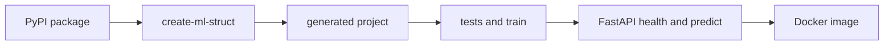

# ML Production Ecosystem

Published Python generator for local-first ML project scaffolds, plus repository-only lifecycle examples for production ML engineering.

## Generate a served model

Prerequisites: Python 3.11+ and `uv`. Docker is required only for the container step.

From any directory outside this checkout:

```bash
uvx --refresh --from ml-production-ecosystem==0.1.0 create-ml-struct churn-api --preset served-model --no-input
```

That single command only generates the project. Testing, training, serving, prediction, and container building remain explicit commands inside the generated project:

```bash
cd churn-api
uv run pytest
uv run python -m churn_api.train
PORT=18080 uv run serve
```

In another terminal:

```bash
curl http://127.0.0.1:18080/health
curl -X POST http://127.0.0.1:18080/predict \
  -H "Content-Type: application/json" \
  -d '{"features":{"a":1.0,"b":2.0}}'
docker build -t churn-api .
```

The default `served-model` preset resolves `training`, `evaluation`, `api`, `deployment`, `quality-gate`, `monitoring`, `docker`, and `ci`.



## Generated served-model tree

```text
churn-api/
├── .github/workflows/ci.yml
├── Dockerfile
├── README.md
├── configs/project.yaml
├── data/README.md
├── docs/
│   ├── infra-checklist.md
│   └── runbook.md
├── ml-struct.yaml
├── orchestration/monitoring_job.py
├── pyproject.toml
├── tests/
│   ├── test_deployment.py
│   ├── test_evaluate.py
│   ├── test_scaffold.py
│   └── test_training.py
└── churn_api/
    ├── __init__.py
    ├── api.py
    ├── deployment.py
    ├── evaluate.py
    ├── predict.py
    └── train.py
```

After training, these evidence files are created:

```text
artifacts/reports/training-summary.json
artifacts/reports/metrics.json
```

The starter contract is intentionally honest: training writes deterministic evidence only. `/predict` remains a dummy threshold seam and does not load the training artifact. Replace `churn_api/predict.py` and its API contract when integrating a real model.

## Other presets

```bash
uvx --from ml-production-ecosystem==0.1.0 create-ml-struct --list-presets
```

Available presets: `kaggle`, `generic-classifier`, `served-model`, `asr-served-model`, `recommendation`, `batch-inference`, `existing-model-wrapper`, `llm-post-training`, and `enterprise-pipeline`.

The full wizard remains available as `ml-struct` or `mle`. It can select task, model type, backend, provider, and repeatable infrastructure components. Component dependencies are auto-added and recorded in `ml-struct.yaml`.

## Repository-only development

Clone the repository only to work on the generator or run its broader lifecycle examples:

```bash
cd ml-production-ecosystem
uv run ml-struct doctor
uv run ml-struct quickstart
./scripts/validate-production-patterns.sh
./scripts/validate-served-model-release.sh
```

| Area | Path | Purpose |
|---|---|---|
| Runtime package | `src/ml_production_ecosystem/` | Importable generator and local MLOps examples |
| Scaffold templates | `src/ml_production_ecosystem/templates/scaffold/` | Packaged template resources used by source, wheel, and sdist installs |
| Examples | `examples/samples/` | Repository-only runnable samples |
| Runtime state | `artifacts/`, `logs/`, `registry/` | Generated local evidence outside source code |
| Configs | `configs/` | Repository lifecycle and provider-boundary examples |

The repository is local-first. It does not claim managed cloud deployment, a real Kubernetes runtime, production paging, or automatic use of a trained artifact by generated serving code.
